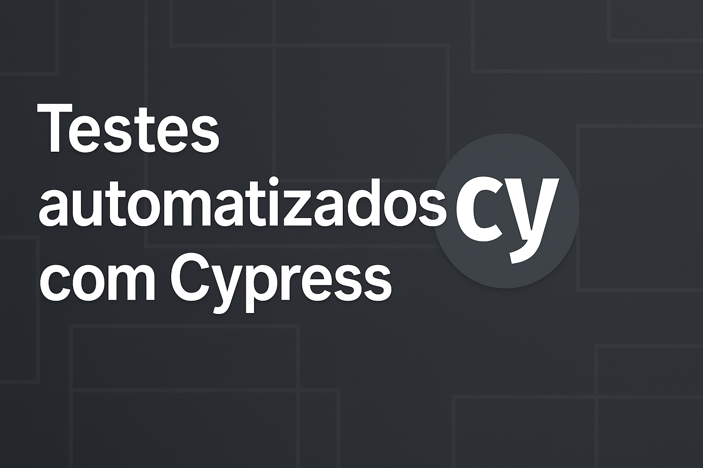

# Testes Automatizados com Cypress

Este repositório contém testes E2E (end-to-end) automatizados utilizando o framework [Cypress](https://www.cypress.io/).  
Os testes são baseados no site de exemplo: [https://automationexercise.com](https://automationexercise.com).

---

## 📁 Estrutura do Projeto

cypress/
├── e2e/
│ └── frontend/
│ ├── cadastro-e-compra.cy.js
│ ├── cadastro-usuario.cy.js
│ ├── carrinho.cy.js
│ ├── login-invalido.cy.js
│ └── remover-carrinho.cy.js
├── fixtures/
├── support/
├── videos/ # ignorado no .gitignore
├── screenshots/ # ignorado no .gitignore

---

## 🚀 Como Executar os Testes

1. Instale as dependências:

   npm install

2. Execute o Cypress em modo interativo:

npx cypress open

3.Ou execute todos os testes via terminal:

npx cypress run

✅ Cenários Testados
Cadastro de novo usuário

Login e logout

Adição e remoção de produtos do carrinho

Finalização de pedidos

Validações de erros (login inválido etc.)

## Observações 📝

Os testes são baseados no site: https://automationexercise.com

Vídeos e screenshots de testes falhos são ignorados no repositório via .gitignore.

---

### ⚙️ Após salvar o novo conteúdo:

No terminal:

// git add README.md
// git commit -m "Atualiza README com instruções e estrutura do projeto"
// git push origin main

